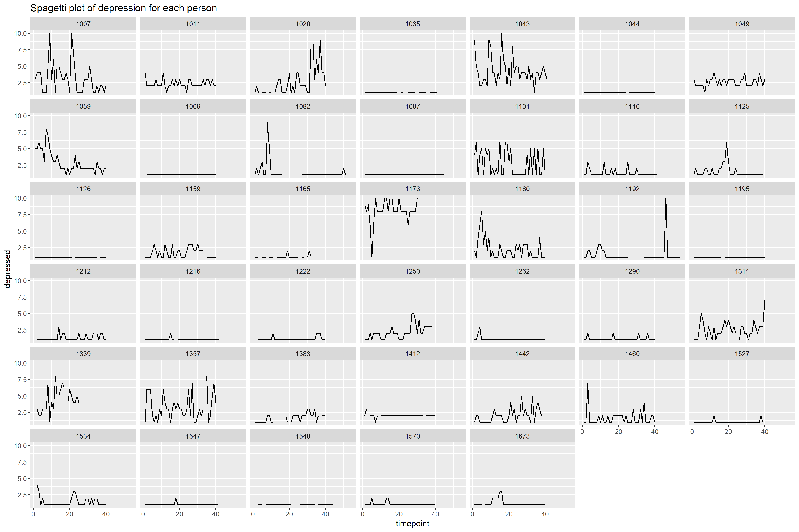

## Co-management and Burnout in Clinical Setting

* __Introduction__

It is a research project I work on with the professor from School of Nursing. The purpose of the study was to determine the impact of provider co-management on self-reported primary care providers' (PCP) burnout and job satisfaction.

* __Methods__

I Entered survey data from about 400 subjects into Excel. I cleaned and recoded variables when necessary as data were collected from paper surveys or online surveys. Data analysis was conducted in R. Both bivariate and multivariable logistic regression models were built to assess the relationship between co-management and burnout related outcomes.

* __Results__

Provider co-management models appear to be a promising approach to alleviate some PCP burnout. The more effective co-management is between providers, the less significantly associated provider burnout, job dissatisfaction and intent to leave current position.

Here is a plot displaying one of the results (not the final version).

## LAtino Sleep and Health (LASH) Study

* __Introduction__

It is a research project I work on with the professor from Department of Biostatistics. The purpose of the study was to examine the associations of emotional, behavioral, and cognitive self-regulation with sleep in urban-dwelling Latina/o adults.

* __Methods__

A cohort of 100 healthy Latino adults were collected data for 40 consecutive days on sleep and self-regulation. (The data collection hasn't completed yet.) Recently, statistical analysis has been done on 40 subjects with repated measurements for at least 40 days in R using Mixed Models and Cumulative Link Mixed Models to investigate the bidirectional relationship between sleep and self-regulation. With data accural, I would write statistical reports, and present results to the professor and his collaborators monthly.

* __Results__

Emotional and behavioral self-regulatory processes are associated with insomnia, and that cognitive self-regulation is associated with both insomnia and overall sleep quality, which could lead to clinical implications.

Here is a plot displaying one of the results (not the final version).

## Virological dynamics in HIV-infected infants

* __Introduction__

It was a research project I worked on with the professor from Department of Biostatistics. The purpose of the study was to .

* __Methods__

* __Results__

Here is a plot displaying one of the results (not the final version).

## Chronic Obstructive Pulmonary Disease (COPD)

* __Introduction__

It was a research project I worked on with the professor from Department of Epidemiology in college. The purpose of the study was to explore pain problems and associated factors for patients with mild or moderate COPD in China.

* __Methods__

Survey data of 283 eligible patients were collected in collaboration with community health care providers. Statistical analysis was conducted in SAS with both bivariate and multivariable logistic regression models built to identify risk factors fassociated with pain problems. 

* __Results__

Pain was common in patients with mild and moderate COPD in the community
settings of Shanghai, China. Severity of COPD and COPD assessment test (CAT) score were significantly related to the prevalence of pain. Intervention measures should be developed to improve pain problems for COPD patients. 

Here is the [paper](journal.html) published in the Journal of Pain Research.

